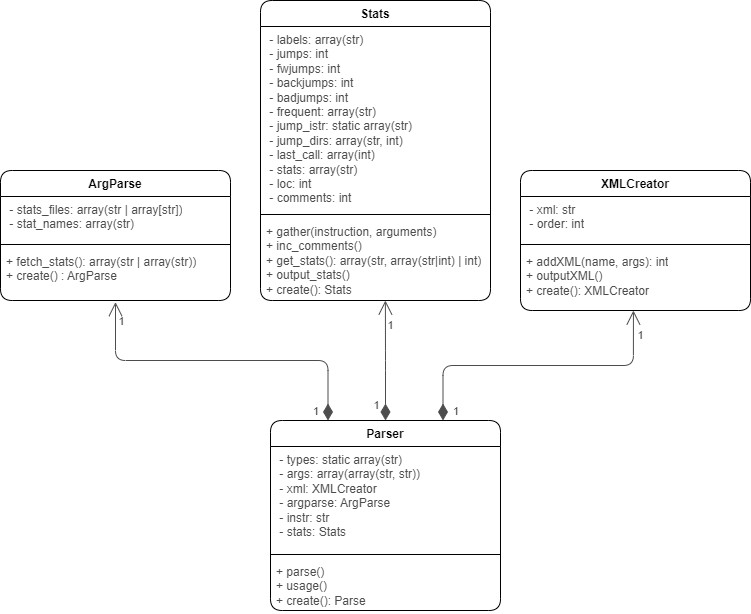

Documentation of Project Implementation for IPP 2022/2023 part I   
Name and surname: Jan Kalenda  
Login: xkalen07  

# Description
A parser for the IPPcode23 language. The parser reads the IPPcode23 program from the standard input and outputs the XML representation of the program to the standard output. The parser also collects statistics about the program and outputs them to the specified files.

# Usage
```python
python interpret.py [--help] [--source=FILE] [--source FILE] [--input=FILE] [--input FILE]
```

where:
- `--help` prints the usage of the program
- `--source=FILE` or `--source FILE` specifies the XML source file
- `--input=FILE` or `--input FILE` specifies the input file for the program  
Either `--source` or `--input` can be omitted, in which case the standard input is used, but not both.

# Classes
The program is divided into four distinct classes
## ArgumentParser
- Class used to parse command line arguments
- Arguments are parsed using the `argparse` module
- `parse()` method returns the list of parsed arguments

## XMLParser
- Class used to parse the XML source file
- The XML file is also validated before parsing
- `get_input()` Method returns the input file specified command line arguments or the standard input
- `get_instructions()` Method returns the iterator over the instructions in the XML file

## Instruction
- Class used to represent a single instruction

## Parser
- Class used to parse a IPPcode23 program
- `parse()` method parses the program and builds up the XML using the XMLCreator class

# Diagram

